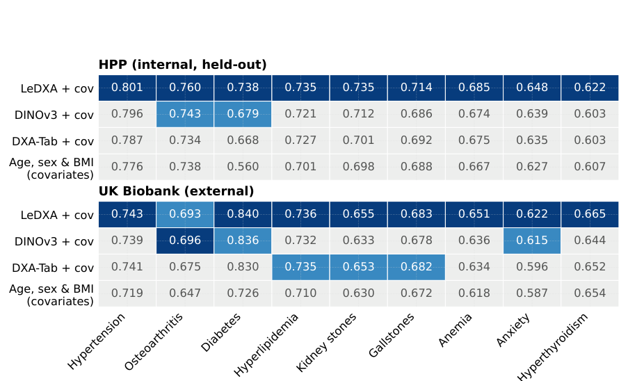
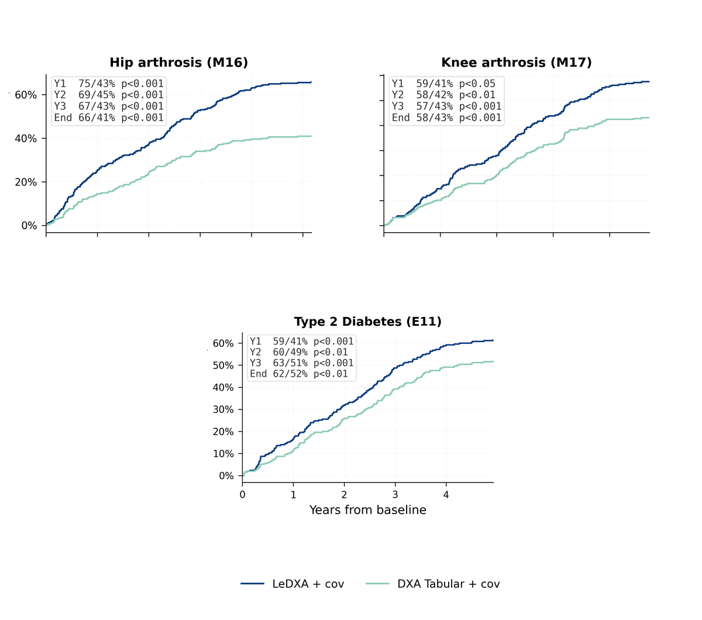

# LeDXA

**A self-supervised foundation model for whole-body dual-energy X-ray absorptiometry (DXA) scans**

Official implementation of *LeDXA: a self-supervised foundation model for dual-energy X-ray
absorptiometry* — **Sasson et al. (2026)**

📄 **Paper:** coming soon <!-- Replace with: [Paper](MANUSCRIPT_URL) --> · [Citation](#citation)

[](assets/figure1.pdf)


## Overview

LeDXA uses a joint-embedding predictive architecture (**JEPA**) with **SIGReg** to learn from the
spatial structure of whole-body DXA scans. It was pretrained from scratch on **11,540 unlabeled HPP
scans** and evaluated externally on **47,400 UK Biobank scans**.

The frozen representation supports prevalent-disease and biomarker prediction, incident-disease
survival analysis, biological-age estimation, embedding GWAS, and unsupervised body-composition
phenotyping. This repository provides the model and training code, embedding extraction, a synthetic
smoke test, de-identified aggregate results, plotting code, and rendered manuscript figures.

## Model

| Property | Value |
|---|---|
| Backbone | ViT-Small/16 (`vit_small_patch16_384`, approximately 22M parameters) |
| Objective | LeJEPA with SIGReg regularization |
| Input | Three-channel whole-body DXA, 384 × 128 pixels |
| Representation | 384-dimensional frozen embedding |
| Pretraining data | 11,540 unlabeled HPP scans |
| External evaluation | 47,400 UK Biobank scans |
| Main baselines | DINOv3, scanner-derived DXA measurements, age/sex/BMI |

## Results

### Cross-cohort disease prediction

LeDXA representations retain strong discrimination across an internal HPP test set and the external
UK Biobank cohort, including cardiometabolic, musculoskeletal, hematological, and endocrine
conditions.

[](figures/fig2_disease_heatmap.pdf)

### Prospective disease risk

Frozen LeDXA embeddings improve incident-disease prediction beyond demographic covariates and
scanner-derived DXA measurements, with particularly strong gains for hip and knee arthrosis and
type-2 diabetes. The preview shows these selected headline outcomes; click it for all evaluated
endpoints in Figure 3.

[](figures/fig3_cox_survival.pdf)

### Biological age and mortality

LeDXA predicts chronological age across HPP and UK Biobank. The resulting biological-age gap
stratifies subsequent mortality: participants in the oldest-appearing quartile have higher adjusted
mortality risk than those in the youngest-appearing quartile.

[](figures/fig5_biological_age.pdf)

## Quick start

LeDXA requires Python 3.10 or newer.

```bash
git clone https://github.com/GilSasson1/LeDXA.git
cd LeDXA
python -m venv .venv
source .venv/bin/activate
pip install -e .
python -m sample_data.demo
```

The smoke test uses only synthetic noise and should finish with:

```text
input (2, 3, 384, 128) -> features (2, 384) -> projections (2, 128)
```

Runtime dependencies are declared in `pyproject.toml`; `requirements.txt` is a compatibility entry
point for tools that expect it. The DINOv3 baseline requires `timm>=1.0.20` and downloads its weights
on first use.

## Repository layout

```text
LeDXA/
├── model/          architecture, datasets, augmentation, training, embedding extraction
├── downstream/     disease, survival, biological-age, clustering, and genetics analyses
├── plotting/       manuscript and supplementary figure generation
├── tables/         de-identified aggregate results and figure inputs
├── figures/        rendered manuscript figures
├── common/         shared statistical, model, Cox, and plotting utilities
├── metadata/       disease display names and analysis grouping rules
├── sample_data/    participant-free synthetic smoke test
├── assets/         README visuals and the complete Figure 1
├── data/           git-ignored location for authorized local data and model outputs
└── config.py       environment-variable-based path and W&B configuration
```

The `downstream/` package is divided into `disease/`, `survival/`, `bioage/`, `clustering/`, and
`genetics/`. More detailed data and output descriptions are available in
[`data/README.md`](data/README.md), [`tables/README.md`](tables/README.md), and
[`figures/README.md`](figures/README.md).

## Training and embedding extraction

Participant-level DXA data are not distributed. To train on authorized HPP-formatted data, configure
the input paths and start pretraining:

```bash
export LEDXA_HPP_DXA_H5=/path/to/dxa_dataset.h5
export LEDXA_HPP_TARGETS_CSV=/path/to/age_targets.csv
export LEDXA_CHECKPOINTS=/path/to/checkpoints

python -m model.train
```

The expected HDF5 and target layout is documented in [`data/README.md`](data/README.md). All paths
can be overridden through [`config.py`](config.py). W&B logging is disabled by default; set
`WANDB_ENTITY` and optionally `WANDB_PROJECT` or `WANDB_MODE` to enable it.

Extract frozen representations from a trained checkpoint with:

```bash
python -m model.extract_embeddings \
  --models lejepa \
  --lejepa-checkpoint /path/to/checkpoint.pth \
  --hdf5-path /path/to/dxa_dataset.h5 \
  --output-dir /path/to/embeddings
```

## Figures and reproducibility

The repository includes de-identified aggregate tables and the rendered main figures. Click any
preview above or use the links below for the complete publication-quality PDF.

| Figure | Scientific result | Public reproduction |
|---|---|---|
| [Figure 1](assets/figure1.pdf) | Study design and model overview | Rendered asset included |
| [Figure 2](figures/fig2_disease_heatmap.pdf) | Disease and physiological-trait prediction | Aggregate inputs included in `tables/` |
| [Figure 3](figures/fig3_cox_survival.pdf) | Incident-disease survival analysis | Render included; curves require participant-level follow-up data |
| [Figure 4](figures/fig4_genetics.pdf) | Embedding GWAS and SNP heritability | Render included; full regeneration requires external GWAS outputs |
| [Figure 5](figures/fig5_biological_age.pdf) | Biological age, health, and mortality | Render included; full regeneration requires participant-level predictions |
| [Figure 6](figures/fig6_female_clusters.pdf) | Body-composition phenotype discovery | Render included; UMAP regeneration requires participant-level embeddings |

Figure 2 can be regenerated from the committed aggregate inputs:

```bash
python -m plotting.fig2_heatmap
```

The remaining plotting scripts are retained as analysis provenance, but some require controlled
cohort inputs or institution-specific data adapters that cannot be distributed publicly. Aggregate
result tables contain no participant-level rows; run `python tools/check_no_pii.py` before publishing
new outputs.

## Data and model availability

No participant-level data or pretrained checkpoint is distributed in this repository. Researchers
can request data access from [UK Biobank](https://www.ukbiobank.ac.uk/) and the
[Human Phenotype Project](https://humanphenotypeproject.org/) and then train LeDXA using the provided
architecture and pipeline.

## Citation

```bibtex
@article{ledxa,
  title  = {LeDXA: a self-supervised foundation model for dual-energy X-ray absorptiometry},
  author = {Sasson, Gil and others},
  year   = {2026},
  note   = {Manuscript in preparation}
}
```

## License

This project is released under the [MIT License](LICENSE).
