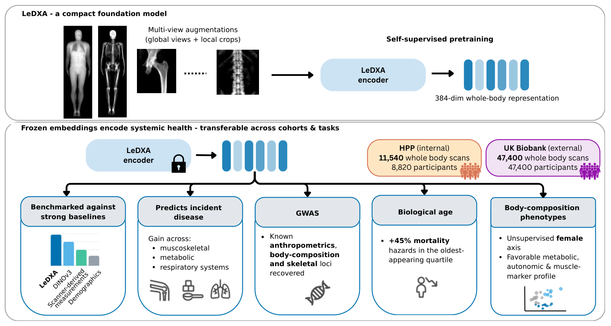
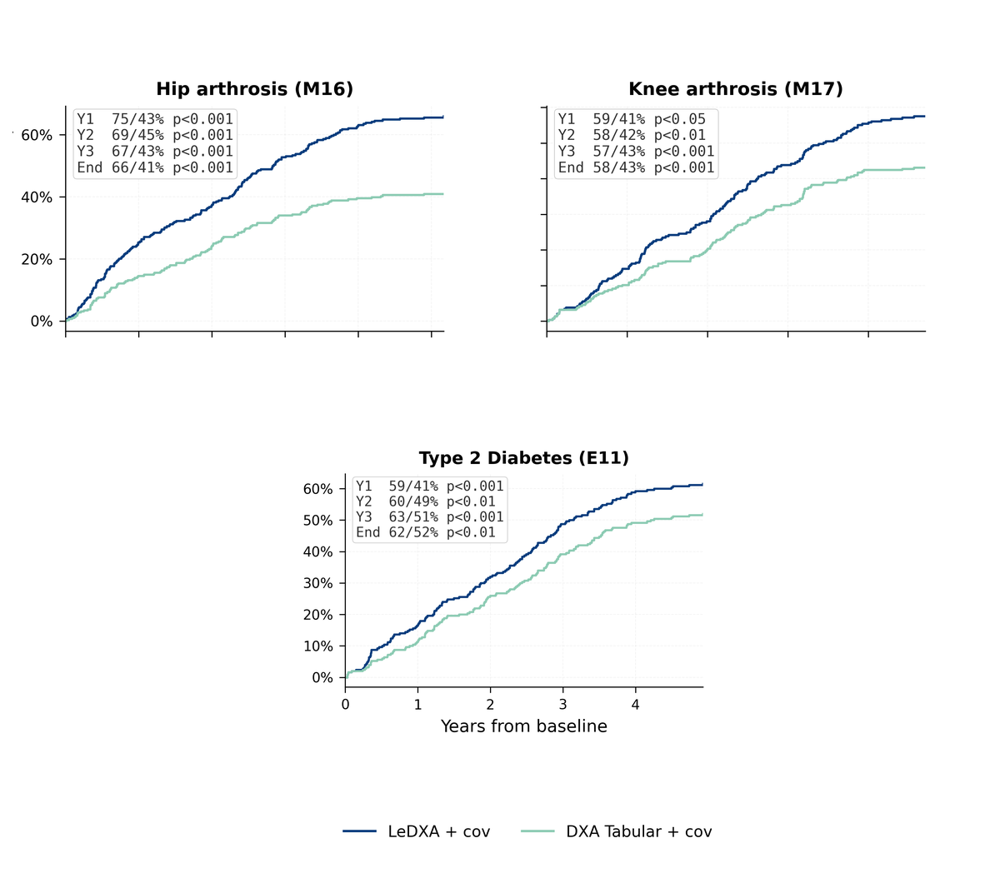
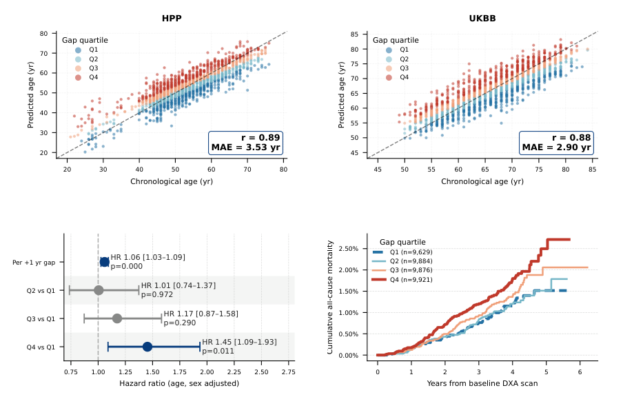

# LeDXA

**A self-supervised foundation model for whole-body dual-energy X-ray absorptiometry (DXA) scans**

Official implementation of *LeDXA: a self-supervised foundation model for dual-energy X-ray
absorptiometry* — **Sasson et al. (2026)**

📄 **Paper:** coming soon <!-- Replace with: [Paper](MANUSCRIPT_URL) --> · [Citation](#citation)

[](assets/figure1.pdf)


## Overview

LeDXA uses **LeJEPA**, a joint-embedding predictive architecture, to learn from the spatial
structure of whole-body DXA scans. It was pretrained from scratch on **11,540 unlabeled HPP
scans** and evaluated externally on **47,400 UK Biobank scans**.

The frozen representation supports prevalent-disease and biomarker prediction, incident-disease
survival analysis, biological-age estimation, embedding GWAS, and unsupervised body-composition
phenotyping. This repository provides the model and training code, embedding extraction, a synthetic
smoke test, de-identified aggregate results, plotting code, and rendered manuscript figures.

## Model architecture

| Property | Value |
|---|---|
| Encoder | ViT-Small/16 (`vit_small_patch16_384`) |
| Parameters | **21,664,128** in the backbone encoder; **26,788,288** with the projection head |
| Input | Bone and tissue DXA scans processed separately at 384 × 128 pixels; each grayscale view is replicated across three channels |
| Patch sequence | 192 image patches (24 × 8) plus one class token |
| Projection head | 384 → 2,048 → 2,048 → 64; used only during pretraining |
| Representation | 384 dimensions per view; 768 dimensions when bone and tissue embeddings are concatenated for late fusion |

## Results

### Cross-cohort disease prediction

LeDXA representations retain strong discrimination across an internal HPP test set and the external
UK Biobank cohort, including cardiometabolic, musculoskeletal, hematological, and endocrine
conditions.

[](figures/fig2_disease_heatmap.pdf)

### Prospective disease risk

Frozen LeDXA embeddings improve incident-disease prediction beyond demographic covariates and
scanner-derived DXA measurements, with particularly strong gains for hip and knee arthrosis and
type-2 diabetes. The preview shows these selected headline outcomes; click it for all evaluated
endpoints in Figure 3.

[](figures/fig3_cox_survival.pdf)

### Biological age and mortality

LeDXA predicts chronological age across HPP and UK Biobank. The resulting biological-age gap
stratifies subsequent mortality: participants in the oldest-appearing quartile have higher adjusted
mortality risk than those in the youngest-appearing quartile.

[](figures/fig5_biological_age.pdf)

## Quick start

LeDXA requires Python 3.10 or newer.

```bash
git clone https://github.com/GilSasson1/LeDXA.git
cd LeDXA
python -m venv .venv
source .venv/bin/activate
pip install -e .
python -m sample_data.demo
```

This command builds a randomly initialized encoder and runs a synthetic batch through it. It checks
that the installation and tensor shapes are correct; it does **not** produce trained LeDXA
embeddings.

Expected output:

```text
input (2, 3, 384, 128) -> features (2, 384) -> projections (2, 128)
```

Dependencies are declared in `pyproject.toml`; `requirements.txt` is provided for compatibility.

## Repository layout

```text
LeDXA/
├── model/          architecture, datasets, augmentation, training, embedding extraction
├── downstream/     portable disease, survival, biological-age, and genetics templates
├── plotting/       manuscript figure generation
├── tables/         de-identified aggregate results and figure inputs
├── figures/        rendered manuscript figures
└── sample_data/    participant-free synthetic smoke test
```

Shared utilities and metadata support these main directories, while paths for controlled data and
outputs are configured through [`config.py`](config.py). Detailed descriptions are in
[`downstream/README.md`](downstream/README.md), [`tables/README.md`](tables/README.md), and
[`figures/README.md`](figures/README.md).


## Figures and reproducibility

The repository includes de-identified aggregate tables and the rendered main figures. Click any
preview above or use the links below for the complete publication-quality PDF.

| Figure | Scientific result | Public reproduction |
|---|---|---|
| [Figure 1](assets/figure1.pdf) | Study design and model overview |
| [Figure 2](figures/fig2_disease_heatmap.pdf) | Disease and physiological-trait prediction |
| [Figure 3](figures/fig3_cox_survival.pdf) | Incident-disease survival analysis |
| [Figure 4](figures/fig4_genetics.pdf) | Embedding GWAS and SNP heritability |
| [Figure 5](figures/fig5_biological_age.pdf) | Biological age, health, and mortality |
| [Figure 6](figures/fig6_female_clusters.pdf) | Body-composition phenotype discovery |

Figure 2 can be regenerated from the committed aggregate inputs:

```bash
python -m plotting.fig2_heatmap
```

The `plotting/` package contains only code used for the main figures. Figure 2 is reproducible from
the included aggregate inputs; the other generators require controlled cohort inputs or external
analysis outputs that cannot be distributed publicly. Aggregate result tables contain no
participant-level rows; run `python tools/check_no_pii.py` before publishing new outputs.

## Data and model availability

Researchers can request data access from [UK Biobank](https://www.ukbiobank.ac.uk/) and the
[Human Phenotype Project](https://humanphenotypeproject.org/). The model and analysis code are
provided for adaptation to authorized DXA datasets.

## Citation

```bibtex
@article{ledxa,
  title  = {LeDXA: a self-supervised foundation model for dual-energy X-ray absorptiometry},
  author = {Sasson, Gil and others},
  year   = {2026},
  note   = {Manuscript in preparation}
}
```

## License

This project is released under the [MIT License](LICENSE).
