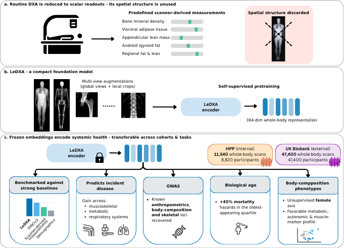
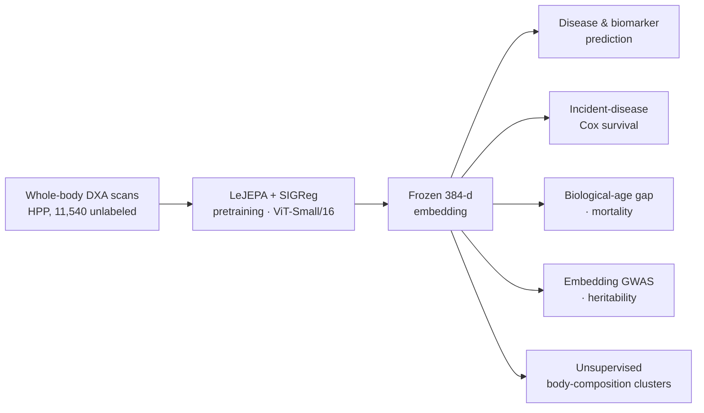

# LeDXA

**A self-supervised foundation model for whole-body DXA scans.**
Code accompanying the paper *"[LeDXA: a self-supervised foundation model for dual-energy X-ray
absorptiometry]"* — 📄 *manuscript link / DOI: TBD*.

**Study overview — [Figure 1](assets/figure1.pdf)** (conceptual schematic; PDF). To show it inline on
GitHub, export it to `assets/figure1.png` and uncomment the next line:
<!--  -->



## Overview

Whole-body DXA scans are routinely acquired to measure bone density and regional body composition,
leaving their spatial structure largely unused. **LeDXA** shows that self-supervised learning can
convert raw DXA images into general representations of systemic health. It is a vision model based on
a **joint-embedding predictive architecture (JEPA)**, trained by predicting image features in latent
space (rather than reconstructing pixels) and regularized with **SIGReg**. It was trained from scratch
on **11,540 unlabeled DXA scans** from the Human Phenotype Project (HPP) and evaluated internally and
on **47,400 external UK Biobank (UKBB)** scans.

Despite using ~5 orders of magnitude fewer training images and ~40× fewer parameters than DINOv3, the
frozen LeDXA embedding improves cross-cohort prediction of prevalent disease and physiological
biomarkers over scanner-derived DXA readouts and DINOv3; improves longitudinal prediction of incident
disease (notably hip/knee arthrosis and type-2 diabetes); yields a biological-age gap that tracks
disease burden and mortality; and produces an embedding space whose GWAS recovers known
body-composition and bone-density loci with higher SNP-heritability than DINOv3's.

## Architecture

| | |
|---|---|
| Backbone | ViT-Small/16 (`vit_small_patch16_384`, ~22M params) |
| Objective | LeJEPA (joint-embedding predictive) + SIGReg regularizer |
| Input | Whole-body DXA image, 384 × 128 |
| Embedding | 384-dimensional, used **frozen** for all downstream tasks |
| Pretraining corpus | 11,540 HPP DXA scans (unlabeled) |
| Baselines | DINOv3 (ViT-Huge) · scanner-derived tabular DXA measures |

## Repository structure

```
model/         LeJEPA + SIGReg pretraining, datasets, augmentations, embedding extraction
common/        shared utilities (probing helpers, plotting style, Cox helpers)
downstream/    frozen-embedding analyses
  disease/       prevalent-disease & biomarker probing (Fig 2, ED Fig 3/4)
  survival/      incident-disease Cox models (Fig 3)
  bioage/        biological-age gap, mortality, medication (Fig 5)
  clustering/    unsupervised body-composition phenotyping (Fig 6)
  genetics/      embedding-GWAS phenotype prep & locus annotation (Fig 4)
plotting/      figure-generation scripts (fig1–fig6, supplementary, extended data)
tables/        de-identified aggregate result tables (supplementary tables, figure inputs)
figures/       rendered manuscript figures
config.py      central path configuration (override via env vars)
sample_data/   synthetic smoke-test (no real data needed)
tools/         data-safety guard (check_no_pii.py)
```

## Setup

```bash
git clone git@github.com:GilSasson1/LeDXA.git && cd LeDXA
python -m venv .venv && source .venv/bin/activate     # Python >= 3.10
pip install -e .
```

`timm` must be recent enough to provide the DINOv3 baseline weights (`vit_*_dinov3.lvd1689m`);
if the baseline fails to load, upgrade `timm`. Run scripts from the repo root (or with the repo root
on `PYTHONPATH`). Data locations are configured in [`config.py`](config.py) / via environment variables;
some scripts contain placeholder paths to point at your own data.

## Quick check

```bash
python sample_data/demo.py     # builds the encoder, embeds a synthetic DXA batch
```

## Training

Pretrain from scratch on your own DXA scans:

```bash
python model/train.py          # LeJEPA + SIGReg, ViT-Small/16, 384×128 inputs
```

DXA images are read from an HDF5 store (see `model/datasets.py` for the expected format) and
augmented per `model/augmentations.py`. Frozen embeddings are then extracted with
`model/extract_embeddings.py` for the downstream analyses.

## Reproducing the figures

Analyses read **de-identified aggregate tables** from `tables/` (no participant-level data). Main
figures and their scripts:

| Figure | Script | Key inputs (in `tables/`) |
|--------|--------|---------------------------|
| **Fig 2** – disease & trait prediction | `plotting/fig2_heatmap.py` | `supp_tableA_disease_auc_4arm_diffpentuned.csv`, `ukbb_pca0_diffpen_summary.csv`, `disease_pairwise_diffpentuned.csv`, `age_mae_imaging_only_wholebody.csv` |
| **Fig 3** – incident-disease Cox | `plotting/fig3_cox.py` | `cox_ttest_results_bp_logsweep_nodxapca.csv` (+ `_perseed`) |
| **Fig 4** – embedding GWAS | `plotting/fig4_genetics.py`, `downstream/genetics/build_fig4c.py` | `fig4c/*.tsv`; GWAS summary stats *(external)* |
| **Fig 5** – biological age | `plotting/fig5_bioage.py` (via `downstream/bioage/run_section.py`) | `tableD_bioage_*`, `tableE_bioage_gap_mortality_cox.csv` |
| **Fig 6** – body-composition clusters | `plotting/fig6_clustering.py` (via `downstream/clustering/run_section.py`) | `tableD_cluster_*` |
| Fig 1 (schematic) | `plotting/fig1_model_panel.py`, `plotting/fig1_downstream_panel.py` | illustrative |

Disease-classification AUROC tables (Supplementary Tables 1–2) are `tables/tableA_hpp_disease_auc_4arm.csv`
and `tables/tableB_ukbb_disease_auc_4arm.csv`. Embedding-GWAS lead loci (genome-wide + suggestive,
P < 1×10⁻⁶) are in `tables/tableS_gwas_lejepa_hits.tsv`.

## Data availability

No participant-level data is included. Access is via the data owners:
**UK Biobank** (https://www.ukbiobank.ac.uk/) and the **Human Phenotype Project**
(https://humanphenotypeproject.org/). Place your data as described in [`data/README.md`](data/README.md).

## Citation

```bibtex
@article{ledxa,
  title  = {LeDXA: a self-supervised foundation model for dual-energy X-ray absorptiometry},
  author = {TBD},
  year   = {2026},
  note   = {Manuscript in preparation}
}
```

## License

[MIT](LICENSE).
